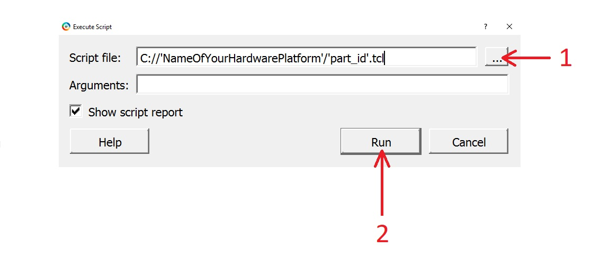
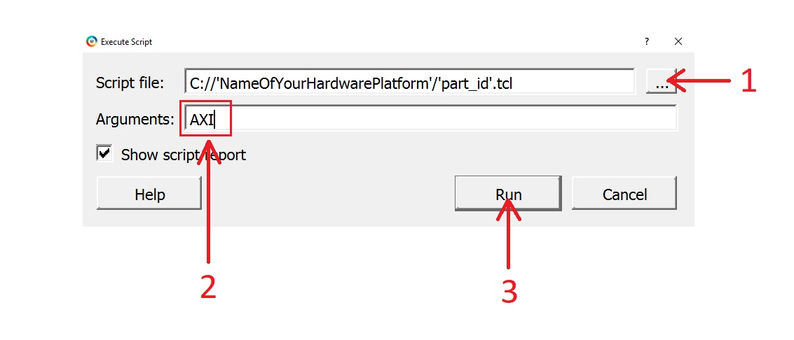
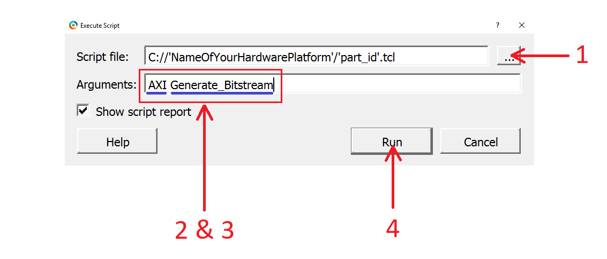

##  RTG4 Development Kit RISC-V Sample Designs for Libero v12.2

Sample RISC-V Libero Projects for RTG4 the Radiation-Tolerant Dev Kit

To get your design download or clone this repository. The files consist of .tcl script files that are to be executed in Libero to build the design, the import folder contatining supporting files for building and the programming file which can be used to directly program hardware. Follow the instructions below to build your design in Libero, alternatively program your target device using the default programming files provided, see FlashPro Express Project's folder.

**Note**: 
* Unpack repository files to your main Microsemi folder e.g. C:\Microsemi\ to keep the file path short, as the project requires
a lengthy file path and some OS systems have limits. **Not providing
a sufficient file path for the project will result in errors**.
* Make sure you have the latest Libero Cores in your vault. Select Catalog tab from the left hand side toolbar and check if the "Download Latest Cores" option is available by a yellow marked area then click it. This option will only be visible if you don't have the lates cores in the vault. If the vault hasn't been updated in a while this could take some time. Not having the library of cores required for the design to be built will cause errors.

### Instructions for Building the Design
-------------

- Launch Libero v12.2 on your computer. Wait for Libero to start, make sure you have the latest Libero cores downloaded.
- Examine the part on your hardware board, and try to match it with the right .tcl file.
- In Libero Press "CTRL+U" to display the "Execute Script" menu. Alternatively, click Project from the top left hand corner of Libero Suite and select "Execute Script" from there.
- Follow the instructions below and refer to the images to build the design.

#### Simple Build
------------------------

1. Click the "..." button and enter the directory in which the main .tcl file is that you have downloaded with your sample project. This file
is what Libero executes to build your design it should match the name of the part on your hardware device device.
2. Click "Run" to execute the script and build the design. Wait for Libero to finish building, a window should appear once the script execution is finished. By default the design will have a MiV_RV32IMA_L1_AHB Core. There are other options, if you're interested read below.

#### Additional Builds
-----------------------------

The design can also be built using a MiV_RV32IMA_L1_AXI Core by passing an argument and it's also possible to be taken further in the design flow by passing an argument after that. Please refer to the image below and text underneath to learn how to build an AXI based design

1. Select the .tcl file that matches the part on your hardware.
2. Type in an argument as shown in the image to build an AXI based design. The arguments are not case sensitive, you can also type in AHB to build a standard AHB based design.
3. Click Run to execute the script and build the design.

#### (Optional) Further in the Design Flow
--------------------------

There is also an optional 2nd argument that can be entered after the first one to be taken further in the design flow and have the design built to a certain stage. Examine the image below and refer to the text undeneath.

1. Select the .tcl file that matches the part on your hardware.
2. Type in an argument for an "AXI" or "AHB" MiV Core based design depending on which you want to use. **This argument is required.**
3. Follow the first argument with a space and type in one of the four arguments, depending on how far you want your design built.
     - Synthesize
      - Place_and_Route
      - Generate_Bitstream
      - Generate_Programming_File
      
**Note**: It is important that the two arguments are separated by a space or the script will fail to execute or will execute partially.
Once the programming file has been generated (.job), it will output to the FlashPro_Express_Projects folder where it will overwrite the default programming file. The file can be used to program the target device using the FlashPro Express.

### Additional Notes
-------------------------

- The project is built in the same folder as the script.
- Once a project is built, to re-run the script for that design again it has to be open.
- If you stop the execution of a the script halfway the project can get corrupted. If this happens, delete the project folder created by Libero and execute the script again, otherwise just try running the script again.
- The design flow arguments serve the purpose to take the user further down the design flow, they use the most optimal settings for design build.
- Use the argument "Place_and_Route" or any argument after; The design will be built using an optimal place and route seed so, that the design's signal data path doesn't cause timing violations.
- If you don't feel like building a design to program the board, you can find the exported programming files in FlashPro_Express_Project folder.
